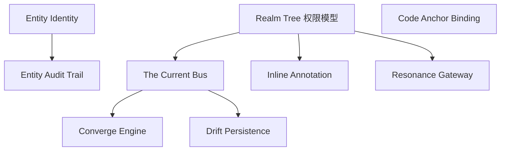

# Phase 1：深度功能头脑风暴

本文件承接 Aether 的差异化定位与技术栈约束，围绕七大维度发散 42 项具体功能。每项功能遵循 API-First 原则——内部实现与第三方共用同一公开接口，并回答"与既有协作工具相比价值何在"。

## 优先级规则

| 优先级 | 含义 | 数量 |
|---|---|---|
| P0 | 差异化主张的直接载体，落在 M0–M2 里程碑内 | 10 |
| P1 | P0 的必要放大器，构成完整产品叙事 | 16 |
| P2 | 生态与远期增强，随平台化推进 | 16 |

## 1.1 The Current 实时协同与 Converge 机制

设计原则：Current 是一条全局状态总线。代码、Thread、评论、Entity 操作写入同一 Y.Doc 命名空间，以 CRDT 作为架构主干，而非编辑器附加层。

| 功能名称 | 描述 | 优先级 | 差异化价值 |
|---|---|---|---|
| The Current Bus | 单一 Y.Doc 承载全部可协同状态，按 Realm 命名空间分区 | P0 | 代码、讨论、部署收敛进同一数据平面，任何写入均可被 Converge、被审计、被回放 |
| Converge Engine | 自定义 Yjs 类型与结构化合并策略，定义字段级冲突裁决规则 | P0 | 冲突从隐式最后写入者胜出变为可配置、可观测、可编程的对象 |
| Realm Channel Partition | 每个 Realm 独立 Y.Doc 与连接通道，CRDT 状态按域物理隔离 | P0 | 从数据平面开始多租户隔离，连接与状态天然不互扰 |
| Presence Stream | Yjs Presence 通道承载连接实例、心跳、游标与在场状态 | P1 | "谁在看什么、谁在做什么"成为第一类感知 |
| Cursor Wavefront | 多人类 / 多 Entity 光标实时渲染，含选区与悬停预览 | P1 | 光标跨编辑器、Thread、Manifestation 三面画布 |
| Current Snapshot | 定时快照 + 时间旅行回放，支持事故诊断与状态恢复 | P2 | 可回放整个协同现场，而非只能回滚文件 |
| Converge Telemetry | 观测合并率、冲突频率、带宽占用与连接质量 | P2 | 协同健康度成为可量化运营指标 |

## 1.2 Entity 作为团队成员

设计原则：Entity 拥有一等公民的全部要件——Better-Auth 身份、Yjs Presence 光标、Drizzle 审计轨迹。匿名服务调用在 Aether 中不存在。

| 功能名称 | 描述 | 优先级 | 差异化价值 |
|---|---|---|---|
| Entity Identity | 每个 Entity 持有 Better-Auth 独立身份，覆盖注册、授权、吊销全生命周期 | P0 | Entity 可被授权、被吊销、被追责，人机同为受管成员 |
| Entity Audit Trail | 全部 Entity 操作写入 Drizzle 审计轨迹：操作者、时间、目标、载荷摘要、结果 | P0 | 合规审计第一次覆盖 AI 行为本身，杜绝不可见操作 |
| Entity Presence Cursor | Entity 在 Current 中持有光标与在场状态 | P1 | 人机协同从黑箱后台变为可观察的协作关系 |
| Entity Handoff Gate | 破坏性或权限敏感操作触发 Entity 暂停，等待人类确认 | P1 | 定义人机责任边界：Entity 处理可逆操作，人类独占裁决权 |
| Entity Memory Loom | Entity 跨 Current 保留任务记忆，随 Realm 知识结晶沉淀复用 | P1 | 从冷启动空上下文到有记忆、能衔接进度的共作者 |
| Capability Manifesto | Entity 声明能力、权限范围与可用工具，经 Realm 策略引擎校验 | P2 | 扩展能力可审计、可收缩 |
| Entity Co-ownership | Thread 与代码片段同时指派给人类与 Entity，双主共同负责 | P2 | 责任模型覆盖人机联合交付场景 |

## 1.3 Context-Bound Threads 与知识沉淀

设计原则：Thread 是绑定了文件范围、代码片段、Manifestation URL 与对话历史的叙事单元，天然消除管理数据与代码上下文之间的断裂。

| 功能名称 | 描述 | 优先级 | 差异化价值 |
|---|---|---|---|
| Code Anchor Binding | Thread 绑定文件范围 / 代码片段，锚点随代码演化可迁移 | P0 | Thread 长在代码上，锚点跟随重构自动漂移，上下文无需人脑记忆 |
| Dialogue Forging | Thread 内嵌与 Entity 的完整对话历史，形成可引用的决策记录 | P1 | AI 对话成为 Thread 的一等公民内容 |
| Manifestation Binding | Thread 绑定 Manifestation URL 与元素级标注 | P1 | 缺陷描述从复现步骤变为直接标注的预览 |
| Rehydration Path | 打开 Thread 时自动重建代码锚点、相关 Entity、对话历史与 Manifestation | P1 | 三个月前的 Thread 依然可读、可执行 |
| Thread Lineage | Thread 支持派生、关联与合并，形成有血缘的决策谱系 | P2 | 需求从线性列表变为可追溯的叙事结构 |
| Resolution Contract | Thread 声明关闭条件与验证步骤，自动检测满足后建议关闭 | P2 | 关闭意味着被验证过，而非被点击过 |
| Knowledge Crystallization | 已解决的 Thread 自动归纳为 Realm 知识条目 | P2 | 知识沉淀是 CRDT 数据的副产品 |

## 1.4 Manifestation 协同审查

设计原则：Vercel Preview 是可协同标注的对象，内嵌于 Current 面板，人机共同审查。

| 功能名称 | 描述 | 优先级 | 差异化价值 |
|---|---|---|---|
| Inline Annotation | 多人实时对 Manifestation 页面元素进行标注与评论，标注持久化为 CRDT 数据 | P0 | Manifestation 可被"一起审"，标注即数据 |
| AI Visual Review | Entity 以视觉能力审查 Manifestation，对照设计意图输出结构化意见 | P1 | Entity 是看见页面、指出像素级问题的审查者 |
| Live Twin | Manifestation 与编辑器双屏联动，改动实时映射 | P1 | 消除改完、部署、再看的循环等待 |
| Spot Diff | 像素级对比两次 Manifestation，自动标出视觉变化区域 | P2 | 审查聚焦本次变化，降低人工比对成本 |
| Manifestation Gallery | 同一分支的历次 Manifestation 归档与演化对比 | P2 | 产品演化轨迹可见，回滚决策有依据 |

## 1.5 Drift 离线优先与重连 Converge

设计原则：离线是架构假设。断网编辑由 Yjs IndexedDB 持久化与 Drizzle 本地缓存共同支撑，重连后自然 Converge。

| 功能名称 | 描述 | 优先级 | 差异化价值 |
|---|---|---|---|
| Drift Persistence | Yjs 状态经 IndexedDB 本地持久化，断网可编辑、可浏览历史 | P0 | 断网是 Drift 模式，编辑不中断，上下文不丢失 |
| Reconnect Handshake | 重连后增量 Converge 并对账，按时间戳恢复未传输更新 | P1 | 重连即自然汇聚，无需全量刷新或手工合并 |
| Local Cache Vault | Drizzle 本地缓存维护离线操作队列与状态，可查询、可回滚 | P1 | 离线期间的操作回来后可审计、可回滚 |
| Conflict Lens | 可视化离线冲突区域，交由人工或策略裁决 | P2 | 冲突成为显式、可管理的对象 |
| Bandwidth Shaping | 大文档按当前带宽自适应传输粒度与压缩策略 | P2 | 弱网环境下协同依旧可用 |

## 1.6 Realm 权限、多租户与安全合规

设计原则：Better-Auth 组织模型承载 Realm > Project > Member 三级嵌套，权限边界即 Schema 边界。

| 功能名称 | 描述 | 优先级 | 差异化价值 |
|---|---|---|---|
| Realm Tree | Better-Auth 组织模型实现 Realm > Project > Member 三级嵌套 | P0 | 权限继承天然分形，Realm 内可再套 Realm |
| Realm Isolation | Drizzle Schema 隔离 + 连接级数据边界 | P1 | 多租户安全是架构属性，而非逐表追加查询条件 |
| Entitlement Engine | 细粒度授权：角色、作用域、资源三级判定，覆盖人类与 Entity | P1 | 权限粒度对齐 CRDT 操作，从"能不能进"细化到"能对哪个文件做什么" |
| Audit Vault | 全量操作审计中心，人类与 Entity 行为统一入账 | P1 | 审计报告同时覆盖人机双方 |
| SSO & SCIM | 企业级单点登录与身份目录同步 | P2 | 与既有企业身份体系无缝接入 |
| Data Residency | 按 Realm 配置数据存储区域 | P2 | 满足跨境合规诉求 |

## 1.7 Resonance 市场与扩展性 API

设计原则：所有内部功能均通过公开 API 实现，Resonance 与核心共鸣而非外挂。API-First 是架构承诺，也是市场化的前提。

| 功能名称 | 描述 | 优先级 | 差异化价值 |
|---|---|---|---|
| Resonance Gateway | 公开 REST API 覆盖 Realm、Thread、Entity、Current、Manifestation 全资源 | P0 | 每个内部功能本身就是 API 的第一位调用者 |
| Webhook Constellation | 事件订阅与回调，签名验证与重试保障 | P1 | Aether 的事件成为外部系统的工作流输入 |
| OAuth App Registry | 第三方应用通过 OAuth 申请身份访问，权限按 Realm 委托 | P1 | 生态接入具备受管身份，而非裸密钥 |
| Resonance Marketplace | 扩展发布、版本管理、订阅与计费闭环 | P2 | 从开发者工具演进为平台经济 |
| Self-host Beacon | 核心能力可自托管，与托管版同一代码基线 | P2 | 企业可掌控数据与代码主权 |

## 优先级分布矩阵

| 维度 | P0 | P1 | P2 | 小计 |
|---|---|---|---|---|
| Current 与 Converge | 3 | 2 | 2 | 7 |
| Entity 作为团队成员 | 2 | 3 | 2 | 7 |
| Context-Bound Threads | 1 | 3 | 3 | 7 |
| Manifestation 协同审查 | 1 | 2 | 2 | 5 |
| Drift 离线优先 | 1 | 2 | 2 | 5 |
| Realm 权限与合规 | 1 | 3 | 2 | 6 |
| Resonance 市场与 API | 1 | 2 | 2 | 5 |
| **合计** | **10** | **17** | **15** | **42** |

## P0 与差异化主张映射

| 差异化主张 | 对应 P0 功能 |
|---|---|
| 协同即架构 | The Current Bus、Converge Engine、Realm Channel Partition |
| AI Entity 是一等公民 | Entity Identity、Entity Audit Trail |
| Context-Bound Threads | Code Anchor Binding |
| Manifestation 作为协同对象 | Inline Annotation |
| Drift 离线优先 | Drift Persistence |
| API-First & Resonance | Resonance Gateway |
| Realm 权限多租户 | Realm Tree |

## P0 依赖关系

说明：Realm Tree 是所有多租户功能的地基；The Current Bus 依赖 Realm 分区；Entity Identity 与 Realm Tree 同源（Better-Auth 身份体系）；Code Anchor Binding 依赖 The Current 的数据平面；Resonance Gateway 在 M2 末段对外暴露。

## 功能与里程碑映射

| 里程碑 | 承载功能 |
|---|---|
| M0 基础设施 | Realm Tree、The Current Bus（Yjs Provider 基线） |
| M1 Current 引擎 | The Current Bus、Converge Engine、Drift Persistence、Presence Stream、Cursor Wavefront |
| M2 Entity 与 Threads | Entity Identity、Entity Audit Trail、Code Anchor Binding、Dialogue Forging、Inline Annotation、Manifestation Binding |
| M3 企业级与公测 | Resonance Gateway、Webhook Constellation、Entitlement Engine、Audit Vault、Realm Isolation、Self-host Beacon |
