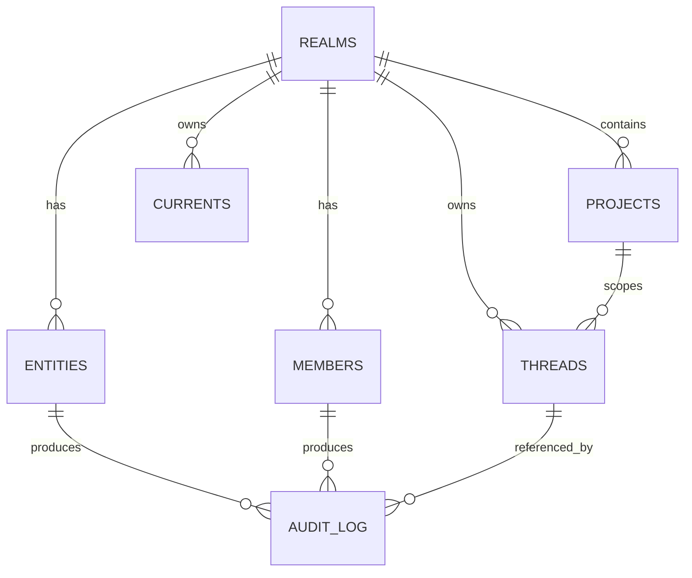

# 核心数据模型草案

本文件给出 Realm / Entity / Thread / Current 的核心数据模型草案，覆盖字段级设计、术语映射与隔离策略。字段命名直接使用 Aether 术语，schema 变更走 Drizzle Kit 迁移流程（见 [team-norms.md](./team-norms.md)）。

> 草案定位：架构规划级字段清单，具体约束（索引、外键、枚举）由 M0 实现阶段在 Drizzle schema 中落地。

## 实体关系总览

## 表结构与字段

### `realms`（领域）

对应 Better-Auth Organization，是隔离边界与权限树根。

| 字段 | 类型 | 说明 |
|---|---|---|
| `id` | uuid | 主键 |
| `slug` | text | 唯一标识，用于 URL 与 API 路径 |
| `name` | text | 展示名 |
| `auth_org_id` | text | 关联 Better-Auth Organization 标识 |
| `schema_namespace` | text | Schema 隔离命名空间（隔离策略见下） |
| `residency` | text | 数据驻留区域 |
| `created_at` / `updated_at` | timestamptz | 时间戳 |

### `projects`（项目，Realm 二级节点）

| 字段 | 类型 | 说明 |
|---|---|---|
| `id` | uuid | 主键 |
| `realm_id` | uuid | 外键 → `realms` |
| `slug` | text | 域内唯一标识 |
| `name` | text | 展示名 |
| `default_branch` | text | 默认分支（Manifestation 基线） |
| `created_at` / `updated_at` | timestamptz | 时间戳 |

### `members`（成员，Realm 三级节点）

覆盖人类与 Entity 两类主体，`actor` 字段区分主体类型。

| 字段 | 类型 | 说明 |
|---|---|---|
| `id` | uuid | 主键 |
| `realm_id` | uuid | 外键 → `realms` |
| `project_id` | uuid | 可空，空表示 Realm 级成员 |
| `actor_type` | enum(`human`, `entity`) | 主体类型 |
| `actor_id` | uuid | 人类用户标识或 Entity 标识 |
| `role` | text | 角色（角色层级在 Entitlement Engine 定义） |
| `entitlements` | jsonb | 细粒度授权声明 |
| `status` | enum(`active`, `suspended`, `invited`) | 状态 |
| `created_at` / `updated_at` | timestamptz | 时间戳 |

### `entities`（实体）

Entity 的一等公民档案。身份认证由 Better-Auth 承载，本表存储业务档案与运行状态。

| 字段 | 类型 | 说明 |
|---|---|---|
| `id` | uuid | 主键 |
| `realm_id` | uuid | 外键 → `realms` |
| `auth_identity_id` | text | 关联 Better-Auth 身份标识 |
| `display_name` | text | 展示名 |
| `capability_manifesto` | jsonb | 能力清单（能力、权限范围、可用工具） |
| `status` | enum(`active`, `idle`, `waiting`, `suspended`) | 运行状态，`waiting` 对应 Handoff Gate |
| `memory_ref` | jsonb | 跨 Current 记忆引用 |
| `created_at` / `updated_at` | timestamptz | 时间戳 |

### `threads`（线程）

Context-Bound 叙事单元，绑定代码锚点、对话历史与 Manifestation。

| 字段 | 类型 | 说明 |
|---|---|---|
| `id` | uuid | 主键 |
| `realm_id` | uuid | 外键 → `realms` |
| `project_id` | uuid | 外键 → `projects` |
| `title` | text | 标题 |
| `status` | enum(`open`, `in_review`, `resolved`, `archived`) | 状态 |
| `code_anchor` | jsonb | 文件范围 / 代码片段锚点（支持随重构迁移） |
| `manifestation_url` | text | 绑定的 Manifestation URL |
| `dialogue_ref` | uuid | 关联对话历史 |
| `resolution_contract` | jsonb | 关闭条件与验证步骤 |
| `parent_thread_id` | uuid | 可空，Thread Lineage 派生关系 |
| `created_at` / `updated_at` | timestamptz | 时间戳 |

### `currents`（当前态）

Yjs Provider 连接实例与 Presence 状态流。

| 字段 | 类型 | 说明 |
|---|---|---|
| `id` | uuid | 主键 |
| `realm_id` | uuid | 外键 → `realms` |
| `doc_ref` | text | Y.Doc 引用标识 |
| `presence_snapshot` | jsonb | Presence 快照 |
| `connection_state` | enum(`active`, `drift`, `converging`) | 连接状态 |
| `last_converge_at` | timestamptz | 最近一次 Converge 时间 |
| `created_at` / `updated_at` | timestamptz | 时间戳 |

### `crdt_updates`（CRDT 更新日志）

Current 增量落库的追加式日志：Server Actions 状态通道与 Hocuspocus 持久化共同依赖它做“落库 + 增量重放”。

| 字段 | 类型 | 说明 |
|---|---|---|
| `id` | uuid | 主键 |
| `realm_id` | uuid | 外键 → `realms` |
| `doc_ref` | text | Y.Doc 引用标识 |
| `seq` | bigserial | 每个 doc 单调递增的重放游标 |
| `payload` | bytea | Yjs 增量（encodeStateAsUpdate 载荷） |
| `actor_type` | enum(`human`, `entity`) | 提交主体类型 |
| `actor_id` | uuid | 提交主体标识 |
| `idempotency_key` | text | 幂等键，唯一约束 (doc_ref, idempotency_key) |
| `created_at` | timestamptz | 时间戳 |

约束与索引：

- 唯一 `(doc_ref, seq)`：游标序唯一。
- 唯一 `(doc_ref, idempotency_key)`：同一增量重复提交静默去重（对应 [risks.md](./risks.md) 风险 6）。
- `(realm_id, doc_ref, seq)`：Realm 隔离下的增量重放路径。

### `audit_log`（审计轨迹）

人类与 Entity 行为统一入账，不可变、可导出。

| 字段 | 类型 | 说明 |
|---|---|---|
| `id` | uuid | 主键 |
| `realm_id` | uuid | 外键 → `realms` |
| `actor_type` | enum(`human`, `entity`) | 主体类型 |
| `actor_id` | uuid | 主体标识 |
| `action` | text | 操作类型（read / write / permission_change / converse / execute） |
| `target` | jsonb | 目标对象（表 / 资源引用） |
| `payload_hash` | text | 载荷摘要，防篡改 |
| `idempotency_key` | text | 幂等键，供 Entity 操作去重 |
| `result` | jsonb | 操作结果摘要 |
| `created_at` | timestamptz | 时间戳 |

## 隔离策略

### Realm Schema 隔离

- 核心表按 Realm 分区：优先采用 `schema_namespace` 动态 schema 隔离，单 Realm 数据物理隔离。
- 查询层在 `@aether/db` 统一封装 Realm 隔离守卫，禁止业务代码直接拼接隔离条件。

### 连接级隔离

- 数据访问经连接池按 Realm 路由，配合 Drizzle 查询守卫双保险。
- 多租户安全是架构属性，而非逐表追加查询条件（对应 [feature-brainstorm.md](../features/feature-brainstorm.md) 的 Realm Isolation）。

### 审计不可变性

- `audit_log` 仅允许追加，payload 以哈希摘要存证。
- Entity 操作强制携带 `idempotency_key`，服务端去重后再落 Current（对应 [risks.md](./risks.md) 风险 6）。
